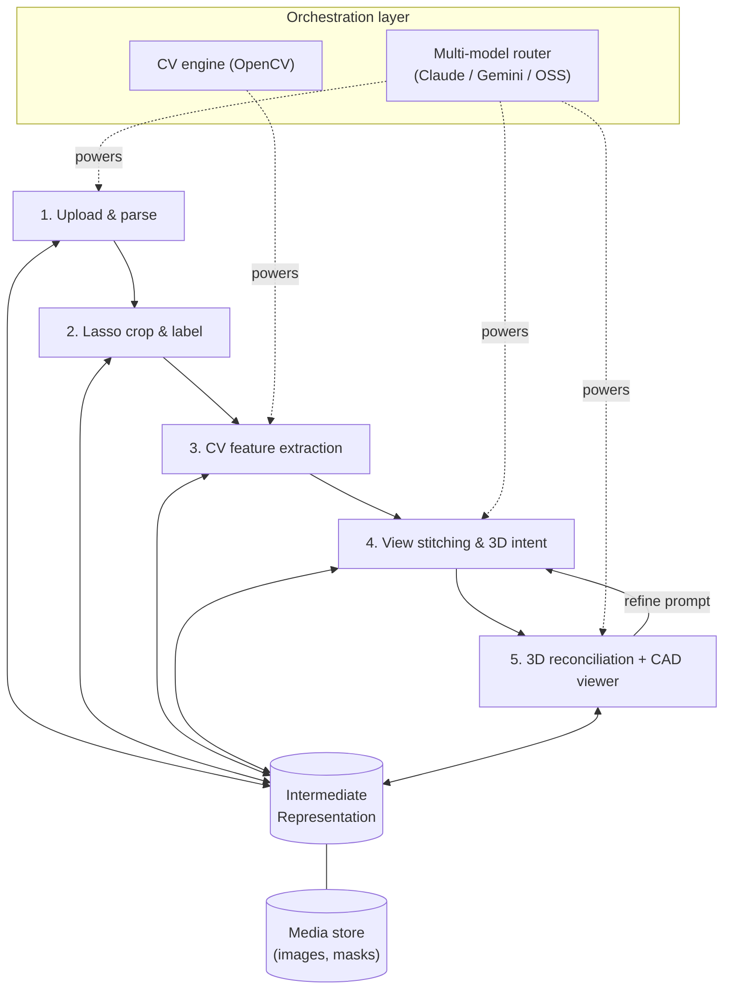
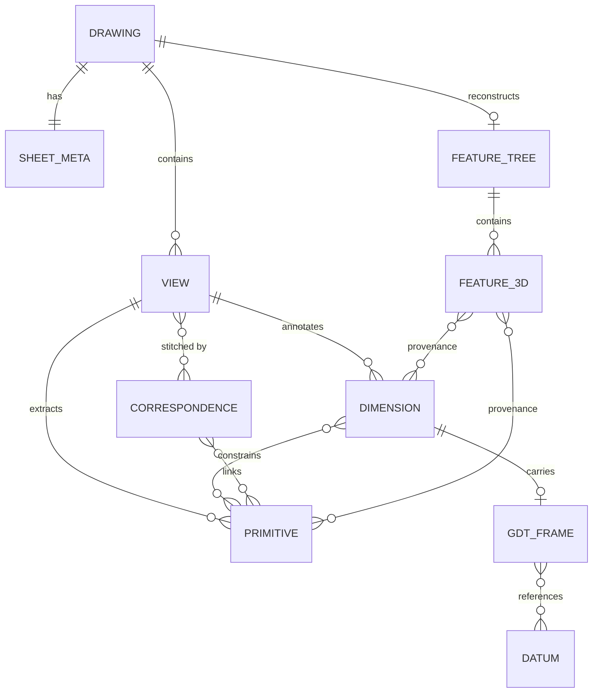

# Drawing-to-3D Reconstruction Interface — Design Document

**Scope of this submission.** Two slices are built to a runnable standard: **Slice A (lasso crop, label & store)** and **Slice B (CV geometry extraction)**. They form one continuous path — lasso a view, crop it, run extraction on that crop, inspect the overlaid geometry, and persist the result into the shared intermediate representation. The remaining stages (drawing parse, view stitching, 3D reconciliation, CAD viewer, prompt loop) and the multi-model abstraction are designed here, not built. Where something is a stub or a planned component, it is called out as such.

This document optimises for one decision the brief makes explicit: the **intermediate representation (IR)** — extracted geometry linked to its dimension and GD&T information — is the deliverable. The 3D model is a validation surface, not the product. Every architectural choice below is justified by whether it makes the IR more accurate, more complete, more traceable, or more queryable.

---

## 1. Design principles

1. **The IR is the contract.** Stages communicate only through the IR. CV writes geometry into it; stitching writes correspondences and intent into it; reconciliation reads it and writes a 3D feature tree back into it. No stage reaches around the IR to talk to another stage directly. This is what lets the viewer be "just validation" — it renders the IR and nothing else.
2. **Humans supply semantics, machines supply geometry.** Fully automatic multi-view solid reconstruction is brittle and ambiguous. The brief already puts a human in the loop (lasso labelling, prose stitching), so the system never has to guess which view is which or how features correspond. That assumption collapses the hardest classical problem into a tractable one.
3. **The LLM emits operations, never geometry.** Foundation models map *intent → CAD operations* (a build recipe); a deterministic geometry kernel turns *operations → B-rep*. The model never produces vertices or meshes, so it cannot hallucinate geometry. This keeps reconciliation auditable and is the backbone of the prompt-and-refine loop.
4. **Everything carries provenance.** Each 3D face traces back to the 2D primitive, the dimension, and the tolerance that produced it. Provenance is what makes the representation *tolerance-aware* and usable for downstream process planning, and it is what the validation viewer surfaces when a user clicks a face.

---

## 2. Architecture

Five sequential stages sit on a shared orchestration layer (a pluggable foundation-model router plus the CV engine). State lives in two places: the **IR document** (structured, queryable) and a **media store** (raw image bytes — the uploaded sheet, per-crop pixels, lasso masks). The IR holds references into the media store, never the bytes themselves.



**Data flow, upload to CAD.** Upload detects the sheet and OCRs the title block (units, scale, projection convention, part metadata) → the human lassoes each view/info block, crops it, and labels it → CV extracts vectorised primitives from each crop and writes them into the IR → the human describes how views correspond and assemble → reconciliation asks the LLM for a parametric build recipe, executes it in the kernel, and writes the 3D feature tree (with provenance) back into the IR → the viewer renders the tessellated result and lets the user click features to confirm them, feeding the refine loop.

**Where state lives.** The IR is a nested document and is queried both by key path (give me view 3's circles) and by relationship (which 3D features depend on dimension D12). That argues for **Postgres with a JSONB IR column plus relational join tables** for the cross-cutting links (geometry↔dimension, feature↔provenance), rather than a pure document store — you want both the document shape and real foreign keys. Image bytes go to object storage (or the filesystem in the prototype); the IR stores URIs. The prototype runs on SQLite + JSON columns to stay zero-config; the schema is written so the move to Postgres is mechanical.

---

## 3. Data model — the intermediate representation

This is the core of the system, so it gets the most detail. The IR is a single tree rooted at a `Drawing`, with explicit cross-references so that geometry, dimensions, tolerances, and 3D output are all linked rather than merely co-located.



**Object sketch (abbreviated JSON).**

```jsonc
Drawing {
  id, source_image_uri, created_at,
  sheet_meta: { units: "mm", scale: "1:2",
                projection: "first_angle",        // critical for stitching (India/EU default)
                title_block: { part_no, material, ... },
                ocr_confidence },
  views: [View],
  correspondences: [Correspondence],
  feature_tree: FeatureTree | null
}

View {
  id, label: "front" | "top" | "side" | "section" | "detail" | "iso",
  crop_uri, mask_uri,                 // from Slice A: the lasso region + bytes
  notes,                              // free-text the user attached
  px_per_mm,                          // pixel→model scale for THIS view
  primitives: [Primitive],
  dimensions: [Dimension]
}

Primitive {                           // produced by Slice B (CV)
  id, kind: "line" | "arc" | "circle" | "spline",
  geom,                               // endpoints / centre+radius / control pts, view-local
  layer: "object" | "dimension" | "hidden" | "centerline" | "unknown",
  confidence
}

Dimension {
  id, kind: "linear" | "diameter" | "radius" | "angular",
  nominal, text_raw,                  // OCR'd value, e.g. "Ø10 ±0.05"
  tolerance: { upper, lower } | null,
  constrains: [primitive_id],         // which geometry this dimension sizes
  gdt: GdtFrame | null
}

GdtFrame {                            // feature control frame (see risks: deferred)
  characteristic: "position" | "flatness" | ...,
  zone, datums: [datum_id]
}

Correspondence {                      // produced by stitching (stage 4)
  id, kind: "same_feature" | "projection_axis" | "section_of",
  members: [primitive_id | view_id],
  intent_text                         // the user's prose, kept verbatim
}

Feature3D {                           // produced by reconciliation (stage 5)
  id, op: "extrude" | "revolve" | "cut" | "fillet" | ...,
  params,                             // depth, axis, etc.
  provenance: { primitives: [id], dimensions: [id] },  // ← the point
  face_ids: [int]                     // kernel face tags for click-to-trace
}
```

The two things that make this an IR rather than a pile of detections: (1) **`constrains` and `provenance` links** turn it into a graph where you can ask "which manufacturing-relevant tolerance governs this 3D face," and (2) **per-view `px_per_mm` plus a sheet-level projection convention** carry enough metric and orientation information for reconciliation to be deterministic rather than guessed. Slices A and B populate `Drawing`, `View`, `Primitive`, and the raw `Dimension.text_raw`; the later stages fill the rest.

---

## 4. CV geometry extraction (built — Slice B)

Given a crop, the pipeline is: denoise and binarise → separate line layers (object vs dimension/centerline) by line weight and dashing → `HoughLinesP` for straight segments, contour finding + circle/ellipse fitting for curved features, and arc splitting for polylines → merge collinear/duplicate segments → emit `Primitive` records in view-local coordinates. Dimension text is OCR'd (Tesseract) and stored as `text_raw`; associating a dimension with the geometry it constrains is done by nearest-leader-line heuristics and surfaced for human confirmation rather than trusted blindly. Output is rendered as an SVG/JSON overlay on the crop so the extraction can be inspected — the inspection step is deliberate, because the IR's value depends entirely on this stage being right. Robust GD&T *symbol* recognition is **not** attempted here (see §8); what is extracted is geometry plus dimension text plus tolerance values parsable from that text.

---

## 5. 3D reconciliation (designed)

Reconciliation turns the IR plus the user's stitching prose into a parametric solid. The approach is **recipe-based, not direct reconstruction**:

1. The LLM receives the structured IR (views, primitives, dimensions, correspondences) and the user's intent text, and is asked to emit a **build recipe** — an ordered list of sketch-and-operation steps (`sketch front profile → extrude 50mm → cut Ø10 through-hole on top axis → fillet edge E4 R2`), each step referencing primitive and dimension IDs.
2. A deterministic kernel (**CadQuery**, a Python API over OpenCASCADE) executes the recipe, producing a B-rep. Because steps reference IR IDs, each resulting `Feature3D` is written back with `provenance` and the kernel's `face_ids`.
3. The user's stitching instructions feed step 1 directly: a `same_feature` correspondence tells the model the top-view circle and the front-view hidden lines are one hole; a `projection_axis` correspondence fixes extrude direction; `section_of` flags a cut plane.

This keeps the model in the role it is reliable for (semantic mapping) and the kernel in the role it is reliable for (exact geometry). It also means reconciliation degrades gracefully — if the model gets one operation wrong, the user corrects that operation in the prompt loop rather than the whole model collapsing.

---

## 6. CAD viewer (designed)

**Recommendation: CadQuery/OCCT server-side, tessellate to glTF, render with three.js in the browser.** Rationale: the heavy CAD kernel stays on the server where the recipe already runs; the client only needs a mesh viewer, which keeps the front end light and embeddable. Tessellating *per face* and tagging triangles with the kernel `face_id` is what enables **click-a-face → show its provenance** (originating 2D primitive, dimension, tolerance) — the concrete way the viewer "validates the representation" instead of just looking nice. `opencascade.js` (OCCT compiled to WASM) is the upgrade path if in-browser B-rep editing is later wanted; FreeCAD and Blender-headless are rejected as too heavy for an embedded validation surface. STEP is exported alongside glTF so the IR is portable into real CAD downstream.

---

## 7. Prompt & visualize loop (designed)

The user sees the rendered solid and types corrections in natural language ("the hole is 8mm deep, not through"; "add a 2mm chamfer on the top edge"). The model does **not** edit geometry — it edits the **build recipe**, addressing operations by ID, and returns a diff of changed steps. The kernel re-executes and the viewer re-renders. Mapping model output back onto geometry is trivial precisely because the recipe is the single source of truth: a changed `cut` operation re-tags the same `Feature3D`, so provenance and any downstream tolerance links survive the edit. Every refinement is versioned, so the user can step back to a prior solid.

---

## 8. Trade-offs, risks, and sequencing

**Hardest parts:** (1) CV extraction on real drawings — separating object geometry from dimension/centerline clutter, OCR of stylised dimension text, and correctly associating a dimension with the edge it sizes; (2) 2D→3D ambiguity — multiple solids can satisfy the same views, which is why human stitching is load-bearing rather than optional.

**Prototype first:** the CV extraction and the IR it writes, on a clean single-part drawing. Everything downstream is worthless if the IR is wrong, so it is correctly the first thing to harden — and it is one of the two slices built here.

**Deliberately deferred:**
- **Full GD&T symbol recognition** (feature control frames, datum symbols). This is genuine specialised CV; the honest scope is dimension-text + parsable tolerances now, symbol recognition later. Claiming working GD&T extraction would be overclaiming.
- **Automatic view detection and cross-view correspondence** — handed to the human via lasso labelling and stitching, by design.
- **Section/auxiliary views and assemblies** — single-part, orthographic-plus-iso first.

**Key risk and mitigation:** model hallucination in reconciliation, mitigated structurally by the emit-operations-not-geometry pattern (§1.3) — the model literally cannot output a vertex, only a named operation the kernel validates.

---

## 9. Assumptions & questions before a full build

**Assumptions:** drawings are single mechanical parts in first-angle projection (India/Europe default; third-angle configurable via sheet_meta); units/scale are legible in the title block or supplied by the user; the user is an engineer who can label views and describe stitching; "open-source CAD viewer" is satisfied by an OCCT-backed three.js surface exporting STEP.

**Questions I'd ask you:** (1) How clean are real input drawings — clean CAD exports, or scanned/photographed paper? That changes the CV budget enormously. (2) Is GD&T symbol parsing in scope for v1, or is dimension-plus-tolerance-text sufficient initially? (3) Does the downstream process-planning consumer want STEP, the raw IR JSON, or both? (4) Is editing the B-rep in-browser required, or is server-side recipe editing with a render-only client acceptable?
